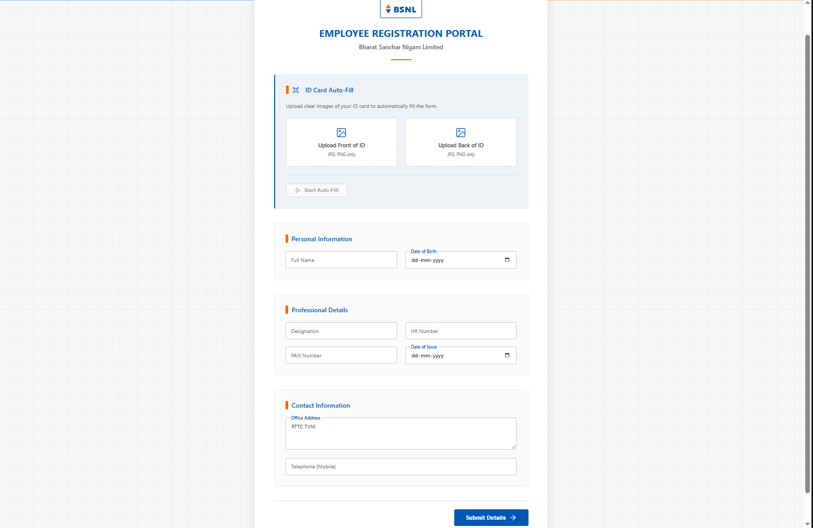
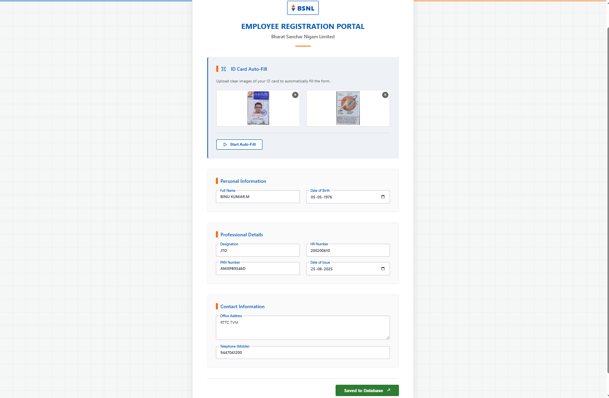
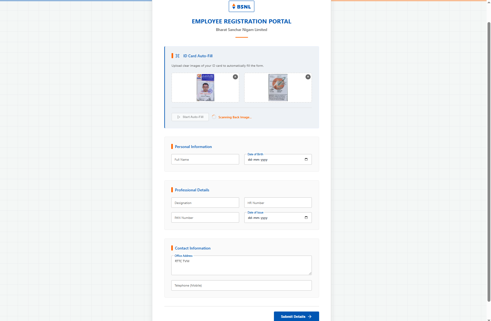
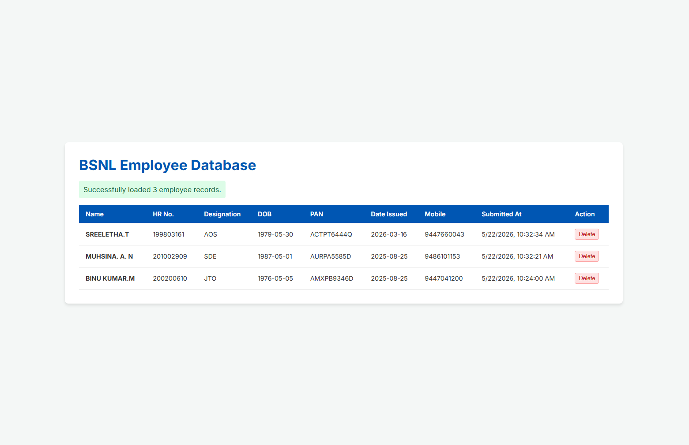

# SancharRegistry

A professional employee registration portal for Bharat Sanchar Nigam Limited (BSNL). This project features client-side ID Card OCR parsing to automatically fill employee details, and stores the submitted entries in a local SQLite database.

## Features
- **Official BSNL Branding**: Clean, modern web UI with official colors (Deep Blue & Orange), responsive grid layouts, and active feedback states.
- **AI-Powered OCR Auto-Fill**: Upload the front and back of your BSNL employee ID card to automatically parse and populate details (Name, DOB, PAN, HR Number) using Tesseract.js.
- **Zero-Setup Database (SQLite)**: Submissions and signature base64 images are saved locally in a `database.sqlite` file inside the project directory.
- **Admin Database Viewer**: An intuitive `admin.html` web dashboard to view, browse, and delete employee records from the database, featuring signature thumbnails that dynamically zoom on hover.

## Key Innovations & Novelties

This portal is distinct from standard database forms thanks to the following technical and design implementations:
- **Client-Side AI OCR (Tesseract.js Integration)**: The application features native Optical Character Recognition (OCR) running completely on the client side using **Tesseract.js**. By executing the OCR engine locally inside the user's browser, employee ID card images are scanned and parsed instantly. This eliminates server processing overhead, protects employee data privacy by keeping document uploads local, and enables smooth auto-fill capability without external cloud API dependencies.
- **Zero-Setup Database Architecture**: Built using a local **SQLite** server-less database file (`database.sqlite`). This eliminates complex external database server setups (such as MySQL/Postgres), allowing the project to run out-of-the-box in seconds.
- **Fuzzy Date & Detail Matching**: Relies on specific Regex parsers to intelligently search raw scanned card text for BSNL HR format structures, PAN card strings, and various Date of Birth formats (dynamically converting them to `YYYY-MM-DD` standard inputs).
- **Dynamic Zoom Previews**: Displays Base64 signature thumbnails in the Admin Dashboard which expand in high-definition (3.5x scaling) upon hover using pure CSS, optimizing UI space.

## Installation & Running

### Prerequisites
Make sure you have [Node.js](https://nodejs.org/) installed on your computer.

### Setup Steps
1. Clone this repository (or download the files):
   ```bash
   git clone https://github.com/dearnavu515/SancharRegistry.git
   cd SancharRegistry
   ```

2. Install the backend dependencies:
   ```bash
   npm install
   ```

3. Start the backend server:
   ```bash
   node server.js
   ```
   *You should see:*
   `Backend server running on http://localhost:3001`
   `Connected to the SQLite database`
 
### Using the Applications
- Open **`index.html`** in your browser to access the registration portal. Fill in the details (or use the ID Card Auto-Fill) and submit.
- Open **`admin.html`** in your browser to view all saved records and delete entries.

## Project Visuals

### Main User Interface


### ID Card Upload


### Auto-Fill in Progress


### Admin Database View

